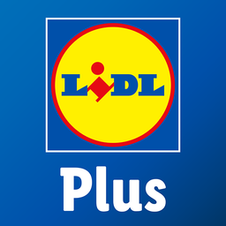

# Lidl Plus (unofficial) — Home Assistant

[![hacs][hacsbadge]][hacs]

Unofficial [HACS](https://hacs.xyz) integration for the **Lidl Plus** app: purchase history and coupons.

Nieoficjalna integracja [HACS](https://hacs.xyz) do programu **Lidl Plus**: historia zakupów i kupony.

**Not affiliated with Lidl or Schwarz Gruppe.** · **Nie jest powiązana z Lidl ani Schwarz Gruppe.**

**Required add-on / wymagany dodatek:** [Browser Companion](https://github.com/Przemko92/homeassistant-browser-companion) (`https://github.com/Przemko92/homeassistant-browser-companion`)

> 🇬🇧 English below · 🇵🇱 Polski poniżej

---

## 🇬🇧 English

Unofficial integration for **Lidl Plus**. It uses the private API of the mobile app (17.9.3). The terms of service do not cover this — use at your own risk (API changes, account, captcha/MFA).

**Required:** [Browser Companion](https://github.com/Przemko92/homeassistant-browser-companion) add-on — without it this integration cannot sign in.

### Installation (HACS)

1. Install the **[Browser Companion](https://github.com/Przemko92/homeassistant-browser-companion)** add-on (Home Assistant OS or Supervised only):
   - Settings → Add-ons → Add-on Store → ⋮ → **Repositories**
   - Add `https://github.com/Przemko92/homeassistant-browser-companion`
   - Install **Browser Companion**, start it, and confirm Chromium appears in the sidebar
2. HACS → ⋮ → **Custom repositories**
3. Add this repository, category **Integration**
4. Search **Lidl Plus** → Download → restart Home Assistant
5. Settings → Devices & services → Add integration → **Lidl Plus**

Manual: copy `custom_components/lidl_plus/` to `/config/custom_components/` and restart. The Browser Companion add-on is still required.

### Sign-in

1. Choose the **country** of your Lidl Plus account. Countries with several languages (Belgium, Switzerland, Luxembourg, …) also ask for a language.
2. Browser Companion opens Chromium and waits for **HTTP 302** with `Location: com.lidlplus.app://callback`.
3. Complete captcha, password and MFA in the sidebar browser.

Without Supervisor (e.g. Container / Core) setup will fail — Companion cannot be installed there.

Refresh tokens rotate on every refresh — that is expected. The official app never shows them.

### Entities

| Entity | Description |
| --- | --- |
| Loyalty card | Lidl Plus card number (`loyaltyId`) |
| Last transactions | Amount of the newest ticket; up to 5 tickets in the `transactions` attribute |
| Today's spend | Sum from today's tickets (country time zone) |
| Coupons | How many coupons are listed; full list in the `coupons` attribute |
| Coupons ready | How many coupons can be activated right now |
| Upcoming coupons | Coupons whose validity window has not started yet |
| Activate coupons | `POST …/v2/promotions/{id}/activation` for each ready coupon |
| Auto coupons | Off by default — when enabled, activates every ready coupon on each refresh |

Refresh interval: every 15 minutes (integration options: 5–120 min).

### Out of scope for v0.1

Lidl Points, payments, leaflets, store finder, self-scanning, invoices.

### API (app 17.9.3)

- Auth: `https://accounts.lidl.com/connect/authorize` and `/connect/token` (OAuth2 PKCE, client `LidlPlusNativeClient`)
- Profile: `https://profile.lidlplus.com/api/v1/{country}/loyalty`
- Tickets: `https://tickets.lidlplus.com/api/v3/{country}/tickets`
- Coupons: `https://coupons.lidlplus.com/app/api/v4/promotionslist`
- `App-Version: 17.9.3`

### Development / debug

You can test the integration itself (without the add-on) in this repo: Dev Containers → HA on port 8123. **There is no Supervisor** — Browser Companion will not install here.

Details: [`.devcontainer/README.md`](.devcontainer/README.md). Locally without a container: `scripts/setup` then `scripts/develop`. The `config/` directory is in `.gitignore`.

### Support

If this integration helps you, you can buy a coffee: [Buy Me a Coffee](https://buymeacoffee.com/przemko92)

---

## 🇵🇱 Polski

Nieoficjalna integracja do programu **Lidl Plus**. Korzysta z prywatnego API aplikacji mobilnej (17.9.3). Regulamin tego nie przewiduje — używasz na własne ryzyko (zmiany API, konto, captcha/MFA).

**Wymagane:** dodatek [Browser Companion](https://github.com/Przemko92/homeassistant-browser-companion) — bez niego integracja nie zaloguje się.

### Instalacja (HACS)

1. Zainstaluj dodatek **[Browser Companion](https://github.com/Przemko92/homeassistant-browser-companion)** (tylko Home Assistant OS albo Supervised).
2. HACS → ⋮ → **Custom repositories** → dodaj to repozytorium, kategoria **Integration**.
3. Szukaj **Lidl Plus** → Download → restart Home Assistant.
4. Ustawienia → Urządzenia i usługi → Dodaj integrację → **Lidl Plus**.

Ręcznie: skopiuj `custom_components/lidl_plus/` do `/config/custom_components/` i zrestartuj.

### Logowanie

1. Wybierz **kraj** konta Lidl Plus. Kraje z kilkoma językami (Belgia, Szwajcaria, Luksemburg…) pytają też o język.
2. Browser Companion otwiera Chromium i czeka na **HTTP 302** z `Location: com.lidlplus.app://callback`.
3. Captcha, hasło i MFA robisz w przeglądarce w sidebarze.

Bez Supervisora (np. Container / Core) konfiguracja się nie uda.

### Encje

| Encja | Opis |
| --- | --- |
| Karta lojalnościowa | Numer karty Lidl Plus |
| Ostatnie transakcje | Kwota ostatniej transakcji; 5 ostatnich w atrybucie `transactions` |
| Dzisiejsze wydatki | Suma z dzisiejszych paragonów (strefa kraju) |
| Kupony | Ile kuponów jest na liście; pełna lista w atrybucie `coupons` |
| Kupony do aktywacji | Ile kuponów można aktywować teraz |
| Kupony przyszłe | Kupony, których ważność jeszcze się nie zaczęła |
| Aktywuj kupony | `POST …/v2/promotions/{id}/activation` dla każdego gotowego kuponu |
| Auto kupony | Domyślnie wyłączone — po włączeniu aktywuje wszystkie gotowe kupony przy odświeżeniu |

Odświeżanie: co 15 minut (opcje: 5–120 min).

### Poza zakresem v0.1

Punkty Lidl, płatności, gazetki, sklepy, self-scan, faktury.

### Wsparcie

Jeśli integracja Ci pomaga, możesz postawić kawę: [Buy Me a Coffee](https://buymeacoffee.com/przemko92)

***

[hacs]: https://github.com/hacs/integration
[hacsbadge]: https://img.shields.io/badge/HACS-Custom-orange.svg?style=for-the-badge
